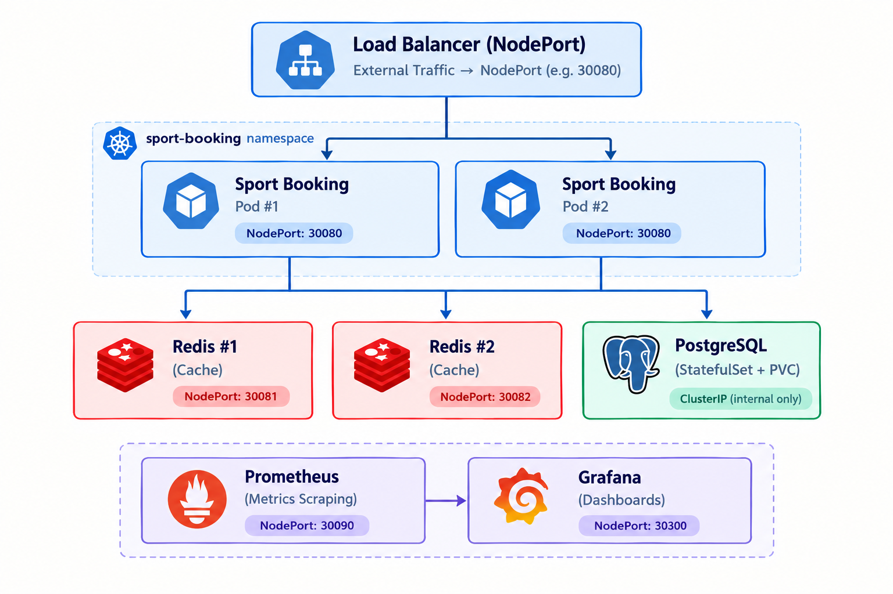
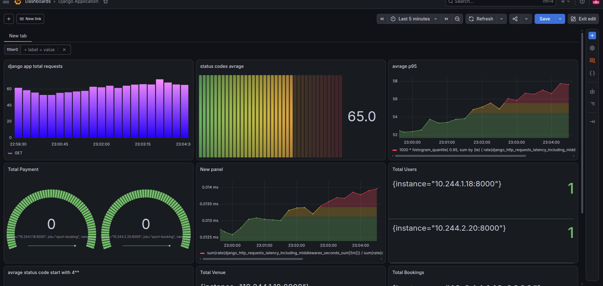
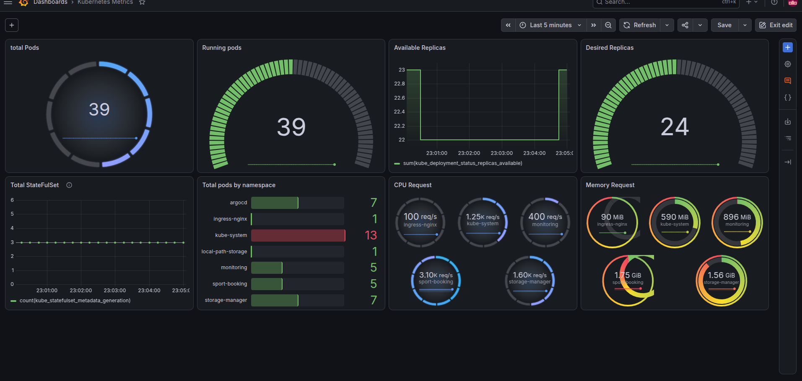
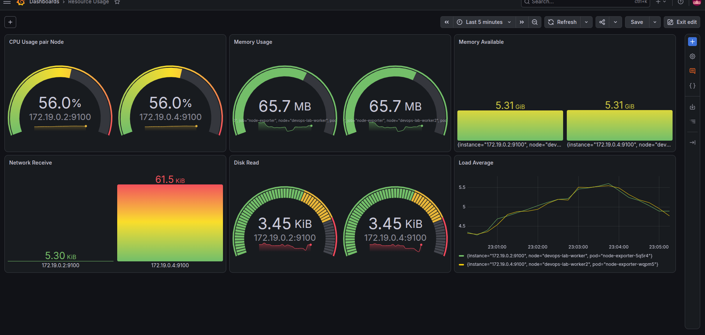

# 🏆 Sport Booking — Kubernetes Deployment

                                   # DEVOPS Section 🌐


 یک پلتفرم رزرو ورزشی که با عشق روی Kubernetes دیپلوی شده 😎


---

## 📖 معرفی پروژه

**Sport Booking** یک بک‌اند **Django** برای سیستم رزرو اماکن ورزشی هست که توی این ریپو روی **Kubernetes** بالا آورده شده. هدف از این معماری:

- 🔁 **High Availability** deployment ,affinity 
- 💾 **Persistent Storage** statefulset database
- ⚡ **Caching Layer** redis with deployment 
- 📊 **Observability**  Prometheus + Grafana + Node Exporter + Kube State Metrics

---

## 🏗️ معماری کلی

<div align="center">
  
</div>

---

## 🧩 کامپوننت‌ها

| کامپوننت | نوع Resource | تعداد Replica | توضیحات |
|----------|--------------|---------------|---------|
| **Sport Booking API** | Deployment | ۲ | اپلیکیشن Django |
| **PostgreSQL** | StatefulSet | ۱ | دیتابیس اصلی با PVC |
| **Redis** | Deployment | ۲ | لایه کش و session store |
| **Prometheus** | Deployment + PVC + RBAC | ۱ | جمع‌آوری متریک‌ها |
| **Grafana** | Deployment + PVC | ۱ | داشبورد و ویژوالایز متریک‌ها |
| **Node Exporter** | DaemonSet | N (به ازای هر Node) | متریک‌های سطح Node |
| **Kube State Metrics** | Deployment | ۱ | متریک‌های سطح Kubernetes Objects |

---

## 📁 ساختار پوشه‌ها

```
sport-booking/
├── backend/                # سورس کد Django
├── k8s/                    # همه مانیفست‌های Kubernetes
│   ├── namespace.yaml
│   ├── kind-config.yaml
│   ├── backend/
│   │   ├── configMap.yaml
│   │   ├── deployment.yaml
│   │   ├── secret.yaml
│   │   └── service.yaml
│   ├── postgres/
│   │   ├── pvc.yaml
│   │   ├── secret.yaml
│   │   ├── service.yaml
│   │   └── statefulset.yaml
│   ├── redis/
│   │   ├── deployment.yaml
│   │   └── service.yaml
│   ├── prometheus/
│   │   ├── prometheus-configmap.yaml
│   │   ├── prometheus-deployment.yaml
│   │   ├── prometheus-namespace.yaml
│   │   ├── prometheus-pvc.yaml
│   │   ├── prometheus-ServiceAccount-rbac.yaml
│   │   └── prometheus-service.yaml
│   ├── grafana/
│   │   ├── grafana-deployment.yaml
│   │   ├── grafana-pvc.yaml
│   │   └── grafana-service.yaml
│   ├── daemonset-node-exporter.yaml
│   ├── service-node-exporter.yaml
│   ├── kube-state-metrics.yaml
│   └── utils/
├── locust/                 # Load testing
├── staticfiles/
├── docker-compose.yml
├── Dockerfile
├── entrypoint.sh
├── manage.py
├── pyproject.toml
├── requirements.txt
└── README.md
```


## 🚀 مراحل Deploy


### 1️⃣ پیش‌نیازها

- یک کلاستر Kubernetes (این پروژه با **kind** تست شده)
- `kubectl` کانفیگ شده
- `kind` (اختیاری، برای ساخت کلاستر لوکال)

### 2️⃣ ساخت کلاستر با kind

```bash
kind create cluster --config k8s/kind-config.yaml
```

### 3️⃣ اعمال مانیفست‌ها (به ترتیب)

```bash
# Namespace اصلی
kubectl apply -f k8s/namespace.yaml

# Namespace مانیتورینگ (اگه جدا باشه)
kubectl apply -f k8s/prometheus/prometheus-namespace.yaml

# PostgreSQL (اول دیتابیس، چون بقیه بهش وابسته‌ن)
kubectl apply -f k8s/postgres/

# Redis
kubectl apply -f k8s/redis/

# اپلیکیشن Django
kubectl apply -f k8s/backend/

# مانیتورینگ
kubectl apply -f k8s/daemonset-node-exporter.yaml
kubectl apply -f k8s/service-node-exporter.yaml
kubectl apply -f k8s/kube-state-metrics.yaml
kubectl apply -f k8s/prometheus/
kubectl apply -f k8s/grafana/
```

### 4️⃣ بررسی وضعیت

```bash
kubectl get pods -A
kubectl get svc -A
kubectl get statefulset -A
kubectl get daemonset -A
```

خروجی مورد انتظار (بخشی از):

```
NAME                                    READY   STATUS
sport-booking-xxxxx-yyyyy               1/1     Running
sport-booking-xxxxx-zzzzz               1/1     Running
postgres-0                              1/1     Running
redis-xxxxx-aaaaa                       1/1     Running
redis-xxxxx-bbbbb                       1/1     Running
prometheus-xxxxx                        1/1     Running
grafana-xxxxx                           1/1     Running
node-exporter-xxxxx                     1/1     Running
kube-state-metrics-xxxxx                1/1     Running
```

---

## 📊 مانیتورینگ

### Prometheus
- **Port:** `9090`
- متریک‌های اپلیکیشن، Podها، Nodeها و Kubernetes Objects رو scrape می‌کنه
- شامل RBAC و ServiceAccount اختصاصی
- داده‌ها روی PVC persist می‌شن

### Grafana
- **Port:** `3000`
- یوزر/پس پیش‌فرض: `admin / admin` (بعد از اولین لاگین عوض کن! 🔐)
- داشبوردهای آماده برای:
  - CPU / Memory مصرفی Podها و Nodeها
  - Request rate و latency اپلیکیشن
  - Connection pool دیتابیس
  - Redis hit/miss ratio
  - وضعیت Deploymentها و StatefulSetها

### Node Exporter
- به صورت **DaemonSet** روی همه‌ی Nodeها بالا میاد
- متریک‌های سطح سیستم‌عامل (CPU, RAM, Disk, Network) رو جمع می‌کنه

### Kube State Metrics
- متریک‌های سطح Kubernetes API رو expose می‌کنه (وضعیت Podها، Deploymentها، PVCها و ...)

دسترسی سریع:

```bash
kubectl port-forward svc/grafana 3000:3000
kubectl port-forward svc/prometheus 9090:9090
```

---

## ⚙️ تنظیمات مهم

### Resource Limits
برای هر Deployment مقادیر `requests` و `limits` تعریف شده تا از resource starvation جلوگیری بشه.

### Health Checks
- **Liveness Probe** برای ری‌استارت خودکار Podهای خراب
- **Readiness Probe** برای جلوگیری از ترافیک به Podهای آماده‌نشده

### Persistent Volume
PostgreSQL از `volumeClaimTemplates` استفاده می‌کنه تا دیتاش بعد از restart/scale حفظ بشه.
Prometheus و Grafana هم PVC اختصاصی دارن.

### Secrets
اطلاعات حساس (DB password، Django SECRET_KEY و ...) توی `secret.yaml` نگه‌داری می‌شن — نه ConfigMap.

### Redis Replication
دو نمونه Redis بالا هست؛ اگه می‌خوای master-slave بشه از **Redis Sentinel** یا **Redis Cluster** استفاده کن.

---


## 🏗️  Django Application DashBoard

<div align="center">
  
</div>

---


## 🏗️  Kuberentes DashBoard

<div align="center">
  
</div>


## 🏗️  Resource DashBoard

<div align="center">
  
</div>


## 🧪 تست سریع

```bash
# چک کن اپ جواب می‌ده
kubectl port-forward svc/sport-booking 8080:8080
curl http://localhost:8080/health

# لاگ‌ها
kubectl logs -f deployment/sport-booking

# ورود به دیتابیس
kubectl exec -it postgres-0 -- psql -U postgres

# Load test با Locust
cd locust && locust -f locustfile.py
```

---

## 🛠️ Tech Stack

- **Backend:** Django (Python)
- **Database:** PostgreSQL
- **Cache:** Redis
- **Orchestration:** Kubernetes (kind)
- **Monitoring:** Prometheus + Grafana + Node Exporter + Kube State Metrics
- **Load Testing:** Locust
- **Containerization:** Docker

---

## 📝 لایسنس

MIT — for learning 𐦂𖨆𐀪𖠋 👥👥

---

## 👤 Author

**شخص حاجی** — چون واقعاً وقت گذاشتیم و درست دیپلوی کردیم🫡

---
🧪اگر به هر دلیلی پروژه مشکل داشت یا بهتر میشد خوشحال میشم PR بزنی یا isuue باز کنی 
>


---
---
---
---
---
---
---
---
---
---
---
---
---

                                      #BackEnd Section 🔨


# 🏟️ پلتفرم رزرو زمین ورزشی

یک API مبتنی بر **Django** و **Django REST Framework** برای مدیریت رزرو زمین‌های فوتبال و سایر اماکن ورزشی.

---

## 📋 فهرست مطالب

- [معرفی پروژه](#-معرفی-پروژه)
- [ویژگی‌ها](#-ویژگی‌ها)
- [تکنولوژی‌ها](#-تکنولوژی‌ها)
- [ساختار پروژه](#-ساختار-پروژه)
- [شروع به کار](#-شروع-به-کار)
- [متغیرهای محیطی](#-متغیرهای-محیطی)
- [اندپوینت‌های API](#-اندپوینت‌های-api)
- [نقش‌های کاربری](#-نقش‌های-کاربری)
- [احراز هویت](#-احراز-هویت)
- [مشارکت](#-مشارکت)

---

## 📌 معرفی پروژه

این پلتفرم به کاربران اجازه می‌دهد تا زمین‌های ورزشی (فوتبال، والیبال، بسکتبال، تنیس و ...) را مرور و رزرو کنند، در حالی که مدیران مجموعه می‌توانند مجموعه‌های ورزشی خود را مدیریت کنند و ادمین‌ها بر کل سیستم نظارت دارند.

---

## ✨ ویژگی‌ها

- 🔐 کنترل دسترسی مبتنی بر نقش (کاربر عادی، مدیر مجموعه)
- 🔐 استفاده از قابلیت Group در Django برای تعریف گروه ادمین
- 📅 مدیریت رزرو و نوبت‌دهی زمین
- 🏢 مدیریت مجموعه‌های ورزشی و زمین‌ها
- 📊 داشبورد ادمین برای کنترل کامل سیستم
- 🔍 فیلتر و جستجوی زمین‌های موجود بر اساس تاریخ، ساعت و نوع ورزش
- 📱 API مبتنی بر REST آماده برای کلاینت‌های وب و موبایل

---

## 🛠️ تکنولوژی‌ها

| لایه | تکنولوژی |
|------|----------|
| زبان | Python 3.11+ |
| فریم‌ورک | Django 5.1.3 |
| API | Django REST Framework (DRF) |
| دیتابیس | PostgreSQL |
| احراز هویت | JWT (SimpleJWT) 5.5.1 |
| مستندسازی | drf-spectacular (Swagger/OpenAPI) |
| فیلترها | django-filters 25.1 |
| تسک‌های async | Celery 5.4.0 |
| فیلد شماره تلفن | django-phonenumber-field 8.4.0 |

---

## 📁 ساختار پروژه

```
sport_booking/
│
├── backend/                            # سورس کد Django
│   ├── backend/                        # تنظیمات پروژه و URLها
│   │   ├── settings.py
│   │   ├── urls.py
│   │   ├── wsgi.py
│   │   └── asgi.py
│   │
│   └── apps/
│       ├── accounts/                   # مدیریت کاربران و احراز هویت
│       │   ├── models.py
│       │   ├── views.py
│       │   ├── serializers.py
│       │   ├── urls.py
│       │   ├── tests.py
│       │   ├── signals.py
│       │   ├── admin.py
│       │   ├── backends.py
│       │   └── apps.py
│       │
│       ├── bookings/                   # مدیریت رزروها
│       │   ├── admin.py
│       │   ├── apps.py
│       │   ├── models.py
│       │   ├── tests.py
│       │   ├── views.py
│       │   ├── serializers.py
│       │   └── urls.py
│       │
│       ├── venues/                     # مدیریت مجموعه‌ها و زمین‌های ورزشی
│       │   ├── models.py
│       │   ├── views.py
│       │   ├── serializers.py
│       │   ├── urls.py
│       │   ├── admin.py
│       │   └── tests.py
│       │
│       └── notifications/              # سیستم مدیریت اعلان‌ها
│           ├── models.py
│           ├── views.py
│           ├── serializers.py
│           ├── urls.py
│           └── tests.py
│
├── k8s/                                # مانیفست‌های Kubernetes
│   ├── namespace.yaml
│   ├── kind-config.yaml
│   ├── backend/
│   │   ├── configMap.yaml
│   │   ├── deployment.yaml
│   │   ├── secret.yaml
│   │   └── service.yaml
│   ├── postgres/
│   │   ├── pvc.yaml
│   │   ├── secret.yaml
│   │   ├── service.yaml
│   │   └── statefulset.yaml
│   ├── redis/
│   │   ├── deployment.yaml
│   │   └── service.yaml
│   ├── prometheus/
│   │   ├── prometheus-configmap.yaml
│   │   ├── prometheus-deployment.yaml
│   │   ├── prometheus-namespace.yaml
│   │   ├── prometheus-pvc.yaml
│   │   ├── prometheus-ServiceAccount-rbac.yaml
│   │   └── prometheus-service.yaml
│   ├── grafana/
│   │   ├── grafana-deployment.yaml
│   │   ├── grafana-pvc.yaml
│   │   └── grafana-service.yaml
│   ├── daemonset-node-exporter.yaml
│   ├── service-node-exporter.yaml
│   ├── kube-state-metrics.yaml
│   └── utils/
│
├── locust/                             # تست بار (Load Testing)
│
├── staticfiles/                        # فایل‌های استاتیک جمع‌آوری‌شده
│
├── logs/                               # لاگ‌های سیستم
│   ├── errors.log
│   └── user_signup.log
│
├── Dockerfile
├── docker-compose.yml
├── entrypoint.sh
├── manage.py
├── pyproject.toml
├── requirements.txt
├── Sport_Booking.postman_collection.json
├── ARCHITECTURE.md
├── LICENSE
└── README.md
```

---

## 🚀 شروع به کار

### پیش‌نیازها

- Python 3.11+
- PostgreSQL
- pip

### نصب

```bash
# کلون کردن ریپازیتوری
git clone https://github.com/amir-hash19/sport_booking.git
cd Sport_Booking

# ساخت و فعال‌سازی محیط مجازی
python -m venv env
source env/bin/activate  # در ویندوز: venv\Scripts\activate

# نصب وابستگی‌ها
pip install -r requirements.txt

# کپی فایل محیطی
cp .env.example .env
# فایل .env را با تنظیمات خودتان ویرایش کنید

# اجرای مایگریشن‌ها
python manage.py migrate

# ساخت سوپریوزر
python manage.py createsuperuser

# اجرای سرور توسعه
python manage.py runserver
```

---

## 🔑 متغیرهای محیطی

یک فایل `.env` بر اساس نمونه بسازید:

```env
SECRET_KEY=your-secret-key-here
DEBUG=True

DB_NAME=sport_booking
DB_USER=postgres
DB_PASSWORD=your-db-password
DB_HOST=localhost
DB_PORT=5432

ALLOWED_HOSTS=localhost,127.0.0.1
```

---

## 📡 اندپوینت‌های API

### احراز هویت
| متد | اندپوینت | توضیحات | دسترسی |
|-----|----------|---------|--------|
| POST | `/api/v1/token/` | دریافت توکن | عمومی |
| POST | `/api/v1/token/verify/` | بررسی توکن JWT | عمومی |
| POST | `/api/v1/user/signup/` | ثبت‌نام کاربر | عمومی |
| POST | `/api/v1/user/login/` | ورود کاربر | عمومی |

### مجموعه‌های ورزشی
| متد | اندپوینت | توضیحات | دسترسی |
|-----|----------|---------|--------|
| GET | `/api/complexes/` | لیست همه مجموعه‌ها | عمومی |
| POST | `/api/complexes/` | ساخت مجموعه | مدیر مجموعه |
| GET | `/api/complexes/{id}/` | جزئیات مجموعه | عمومی |
| PUT | `/api/complexes/{id}/` | ویرایش مجموعه | مدیر مجموعه |
| DELETE | `/api/complexes/{id}/` | حذف مجموعه | ادمین |

### زمین‌ها
| متد | اندپوینت | توضیحات | دسترسی |
|-----|----------|---------|--------|
| GET | `/api/fields/` | لیست همه زمین‌ها | عمومی |
| POST | `/api/fields/` | افزودن زمین | مدیر مجموعه |
| GET | `/api/fields/{id}/` | جزئیات زمین | عمومی |
| PUT | `/api/fields/{id}/` | ویرایش زمین | مدیر مجموعه |
| DELETE | `/api/fields/{id}/` | حذف زمین | ادمین |

### رزروها
| متد | اندپوینت | توضیحات | دسترسی |
|-----|----------|---------|--------|
| GET | `/api/reservations/` | لیست رزروهای کاربر | کاربر |
| POST | `/api/reservations/` | ایجاد رزرو | کاربر |
| GET | `/api/reservations/{id}/` | جزئیات رزرو | کاربر/ادمین |
| DELETE | `/api/reservations/{id}/` | لغو رزرو | کاربر/ادمین |

> 📄 مستندات تعاملی کامل API پس از اجرای سرور در آدرس `/api/schema/swagger-ui/` در دسترس است.

---

## 👥 نقش‌های کاربری و گروه ادمین

| نقش یا گروه | توضیحات | دسترسی‌ها |
|-------------|---------|-----------|
| **ادمین** | دسترسی کامل به سیستم | مدیریت همه کاربران، مجموعه‌ها، زمین‌ها و رزروها |
| **مدیر مجموعه** | مالک یا اپراتور مجموعه | ساخت و مدیریت مجموعه‌ها و زمین‌های خود، مشاهده رزروهای زمین‌هایش |
| **کاربر** | مشتری عادی | مرور زمین‌ها، رزرو و لغو رزرو |

---

## 🔐 احراز هویت

این API از احراز هویت **JWT** با استفاده از `djangorestframework-simplejwt` استفاده می‌کند.

توکن را در هدر درخواست ارسال کنید:

```http
Authorization: Bearer <your_access_token>
```

مدت اعتبار توکن‌ها:
- Access token: ۳ ساعت
- Refresh token: ۵ روز

---

## 🤝 مشارکت

از مشارکت شما استقبال می‌شود! لطفاً مراحل زیر را دنبال کنید:

```bash
# ساخت برنچ جدید
git checkout -b feature/your-feature-name

# اعمال تغییرات و کامیت
git commit -m "feat: add your feature description"

# پوش و باز کردن Pull Request
git push origin feature/your-feature-name
```

---

## 📄 لایسنس

این پروژه تحت لایسنس MIT منتشر شده است.

---

<div align="center">
  ساخته شده با ❤️ توسط <a href="https://github.com/amir-hash19">امیرحسین</a>
</div>